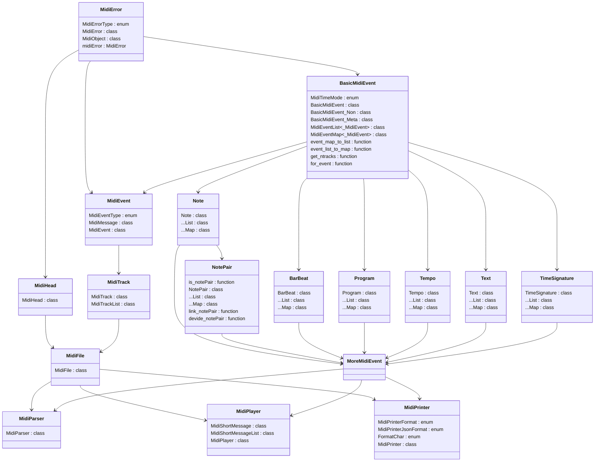

## 项目信息

- 项目名称 : MidiParse 库

- 项目简介 : 本项目提供Midi解析相关的头文件和相关源文件，包含Midi文件读取、解析、播放、输出几个模块。原用于进行Minecraft红石音乐的制作。后因项目规模扩大，形成独立项目并开源。

- 版本号     : v7.0

- 作者         : Csrua / Gold_RsC

- 开发时间 : 2020/04/26 - 2026/03/06

- github     : [Gold-RsC](https://github.com/Gold-RsC)

- bilibili      : [Csrua](https://space.bilibili.com/361846321)

- 邮箱         : 310106329@qq.com

## 项目发展历程

| 主版本号     | 主要更新内容                                                       |
| -------- | ------------------------------------------------------------ |
| 1.0      | 利用SnowyKami的midi转kev的py脚本，对midi进行初步解析。解析kev数据，获得易于程序读取的gev文件 |
| 2.0      | 实现C++直接读取midi文件，可得到音符列表，存储时间(毫秒)、音高、音量                       |
| 3.0/4.0  | 实现用winapi播放midi文件，但未形成库文件                                    |
| 5.0      | 成功解析小节数据，解析歌词数据                                              |
| 6.0      | 添加对format=2的解析，大幅更改midi解析库逻辑，分文件编写，增加debug机制，形成MidiPlayer头文件 |
| 7.0(此版本) | 大幅更改逻辑，形成MidiPrinter头文件，优化debug机制                            |

## 项目构建方法

#### VSCode

以g++为例，task.json应该按下面的内容设置

```json
//task.json
{
    "version": "2.0.0",
    "tasks": [
        {
            "type": "cppbuild",
            "label": "C/C++: g++.exe 生成活动文件",
            "command": "D:\\mingw64\\bin\\g++.exe",// 请把这里修改为你的g++.exe路径
            "args": [
                "-fdiagnostics-color=always",
                "-g",
                "-std=c++11",
                "${file}",//包含main函数的源文件
                "-I${workspaceFolder}/include",
                "-o",
                "${workspaceFolder}/bin/${relativeFileDirname}/${fileBasenameNoExtension}.exe",//可执行文件
                "-lwinmm"
            ],
            "options": {
                "cwd": "${fileDirname}"
            },
            "problemMatcher": [
                "$gcc"
            ],
            "group": {
                "kind": "build",
                "isDefault": true
            },
            "detail": "编译器: D:\\mingw64\\bin\\g++.exe"
        }
    ]
}
```

#### DevC++

若你很不幸选择了DevC++，请在链接器里添加，以确保版本为C++11，且能够链接winmm库

```
-std=c++11
-lwinmm
```

## 项目结构

```
7.0.0/
├── include/
│   ├── MidiError.hpp
│   ├── BasicMidiEvent.hpp
│   ├── MidiEvent.hpp
│   ├── MidiHead.hpp
│   ├── MidiTrack.hpp
│   ├── Note.hpp
│   ├── NotePair.hpp
│   ├── BarBeat.hpp
│   ├── Program.hpp
│   ├── Tempo.hpp
│   ├── Text.hpp
│   ├── TimeSignature.hpp
│   ├── MoreMidiEvent.hpp
│   ├── MidiFile.hpp
│   ├── MidiParser.hpp
│   ├── MidiPrinter.hpp
│   └── MidiPlayer.hpp
├── examples/
│   ├── ...
│   └── ...
├── docs/
│   ├── ...
│   └── ...
├── bin/
│   ├── ...
│   └── ...
├── output/
│   ├── ...
│   └── ...
├── midi/
│   ├── ...
│   └── ...
└── README.md
```

## 头文件包含关系


```mermaid
classDiagram
    class MidiError{
        MidiErrorType : enum
        MidiError : class
        MidiObject : class
        midiError : MidiError
    }
    class BasicMidiEvent{
        MidiTimeMode : enum
        BasicMidiEvent : class
        BasicMidiEvent_Non : class
        BasicMidiEvent_Meta : class
        MidiEventList<_MidiEvent> : class
        MidiEventMap<_MidiEvent> : class
        event_map_to_list : function
        event_list_to_map : function
        get_ntracks : function
        for_event : function
    }
    class MidiEvent{
        MidiEventType : enum
        MidiMessage : class
        MidiEvent : class
    }
    class MidiTrack{
        MidiTrack : class
        MidiTrackList : class
    }
    class MidiHead{
        MidiHead : class
    }
    class MidiFile{
        MidiFile : class
    }
    class MoreMidiEvent{
    }
    class MidiParser{
        MidiParser : class
    }
    class MidiPlayer{
        MidiShortMessage : class
        MidiShortMessageList : class
        MidiPlayer : class
    }
    class MidiPrinter{
        MidiPrinterFormat : enum
        MidiPrinterJsonFormat : enum
        FormatChar : enum
        MidiPrinter : class
    }
    class Note{
        Note : class
        ...List : class
        ...Map : class
    }
    class NotePair{
        is_notePair : function
        NotePair : class
        ...List : class
        ...Map : class
        link_notePair : function
        devide_notePair : function
    }
    class BarBeat{
        BarBeat : class
        ...List : class
        ...Map : class
    }
    class Program{
        Program : class
        ...List : class
        ...Map : class
    }
    class Tempo{
        Tempo : class
        ...List : class
        ...Map : class
    }
    class Text{
        Text : class
        ...List : class
        ...Map : class
    }
    class TimeSignature{
        TimeSignature : class
        ...List : class
        ...Map : class
    }
    MidiError --> MidiEvent
    MidiError --> BasicMidiEvent
    BasicMidiEvent --> MidiEvent
    MidiEvent --> MidiTrack
    MidiError --> MidiHead
    MidiHead --> MidiFile
    MidiTrack --> MidiFile
    BasicMidiEvent--> Note
    Note--> NotePair
    BasicMidiEvent--> BarBeat
    BasicMidiEvent--> Program
    BasicMidiEvent--> Tempo
    BasicMidiEvent--> Text
    BasicMidiEvent--> TimeSignature
    Note --> MoreMidiEvent
    NotePair --> MoreMidiEvent
    BarBeat --> MoreMidiEvent
    Program --> MoreMidiEvent
    Tempo --> MoreMidiEvent
    Text --> MoreMidiEvent
    TimeSignature --> MoreMidiEvent
    MidiFile --> MidiParser
    MoreMidiEvent --> MidiParser
    MidiFile --> MidiPlayer
    MoreMidiEvent --> MidiPlayer
    MidiFile --> MidiPrinter
    MoreMidiEvent --> MidiPrinter
```

类的继承关系可以通过上图有基本的认识，详细情况可见下方细节文档4


## 细节文档

目前只有三大板块的细节文档完成编写，三小模块的细节文档还在编写中。

### 三大板块

| 三大板块   | 相关头文件       | 相关细节文档                    |
|:------:|:-----------:|:-------------------------:|
| Midi解析 | MidiParser  | [parse.md](docs/parse.md) |
| Midi播放 | MidiPlayer  | [play.md](docs/play.md)   |
| Midi打印 | MidiPrinter | [print.md](docs/print.md) |

### 三小模块

| 三小模块      | 相关头文件         | 相关细节文档                              |
|:---------:|:-------------:|:-----------------------------------:|
| 错误处理层      | MidiError     | [debug.md](docs/debug.md)           |
| Midi文件抽象层    | MidiFile      | [file.md](docs/file.md)             |
| 具体的Midi事件 | MoreMidiEvent | [more_event.md](docs/more_event.md) |

 

## 特别鸣谢

#### [Snowykami](https://github.com/snowykami)

在此特别向 **[Snowykami](https://github.com/snowykami)** 表达诚挚的谢意：

**技术贡献**：

- 开发midi转kev脚本，为本项目的midi解析奠定基础
- 在项目1.0时期提供重要的技术指导

**个人影响**： 

- 作为红石音乐与特效的启蒙导师，耐心答疑解惑
