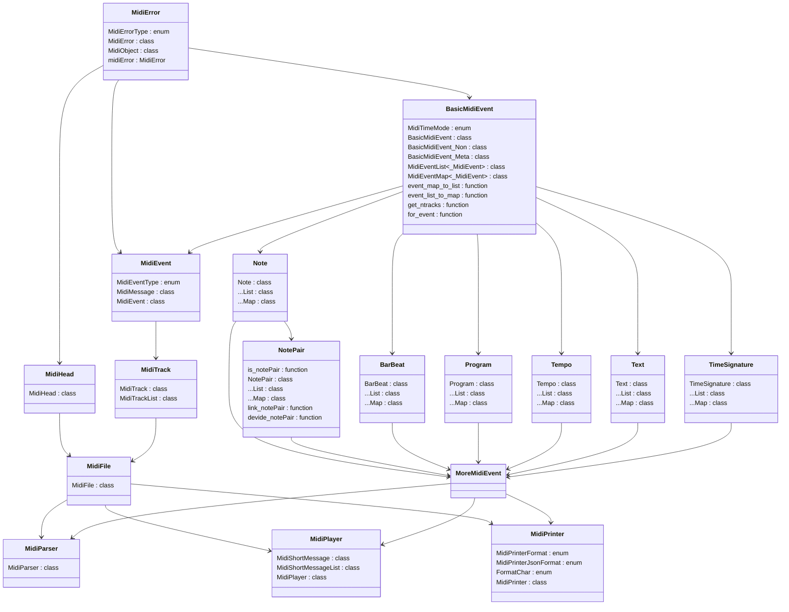

## 项目信息

- 项目名称 : MidiParse

- 版本号     : 7.0.0

- 作者         : Csrua / Gold_RsC

- 开发时间 : 2020/07/26 - 2025/12/01

- github     : Gold-RsC(https://github.com/Gold-RsC)

- bilibili      : Csrua(https://space.bilibili.com/361846321)

- QQ           : 310106329

- 许可证     : MIT许可证

## 特别鸣谢

#### Snowy-kami

在此特别向 **Snowy-kami** 表达诚挚的谢意：

**技术贡献**：

- 开发midi转kev脚本，为本项目的midi解析奠定基础
- 在项目1.0时期提供重要的技术指导

**个人影响**： 

- 作为红石音乐与特效的启蒙导师，耐心答疑解惑

## 项目发展历程

| 主版本号     | 主要更新内容                                                        |
| -------- | ------------------------------------------------------------- |
| 1.0      | 利用Snowy-kami的midi转kev的py脚本，对midi进行初步解析。解析kev数据，获得易于程序读取的gev文件 |
| 2.0      | 实现C++直接读取midi文件，可得到音符列表，存储时间(毫秒)、音高、音量                        |
| 3.0/4.0  | 实现用winapi播放midi文件，但未形成库文件                                     |
| 5.0      | 成功解析小节数据，解析歌词数据                                               |
| 6.0      | 添加对format=2的解析，大幅更改midi解析库逻辑，分文件编写，增加debug机制，形成MidiPlayer头文件  |
| 7.0(此版本) | 大幅更改逻辑，形成MidiPrinter头文件，优化debug机制                             |

## 项目构建方法

#### VSCode

task.json应该按下面的内容设置

```json
//task.json
{
    "version": "2.0.0",
    "tasks": [
        {
            "type": "cppbuild",
            "label": "C/C++: g++.exe 生成活动文件",
            "command": "D:\\mingw64\\bin\\g++.exe",// 请把这里修改为你的编译器
            "args": [
                "-fdiagnostics-color=always",
                "-g",
                "-std=c++11",
                "${workspaceFolder}/src/MidiError.cpp",
                "${workspaceFolder}/src/BasicMidiEvent.cpp",
                "${workspaceFolder}/src/MidiEvent.cpp",
                "${workspaceFolder}/src/MidiTrack.cpp",
                "${workspaceFolder}/src/MidiHead.cpp",
                "${workspaceFolder}/src/Note.cpp",
                "${workspaceFolder}/src/NotePair.cpp",
                "${workspaceFolder}/src/BarBeat.cpp",
                "${workspaceFolder}/src/Program.cpp",
                "${workspaceFolder}/src/Tempo.cpp",
                "${workspaceFolder}/src/Text.cpp",
                "${workspaceFolder}/src/TimeSignature.cpp",
                "${workspaceFolder}/src/MidiFile.cpp",
                "${workspaceFolder}/src/MidiParser.cpp",
                "${workspaceFolder}/src/MidiPrinter.cpp",
                "${workspaceFolder}/src/MidiPlayer.cpp",
                "${file}",//包含main函数的源文件
                "-I${workspaceFolder}/include",
                "-o",
                "${workspaceFolder}/${relativeFileDirname}/${fileBasenameNoExtension}.exe",//可执行文件
                "-lwinmm"
            ],
            "options": {
                "cwd": "${fileDirname}"
            },
            "problemMatcher": [
                "$gcc"
            ],
            "group": {
                "kind": "build",
                "isDefault": true
            },
            "detail": "编译器: D:\\mingw64\\bin\\g++.exe"
        }
    ]
}
```

#### DevC++

请在链接器里添加

```
-std=c++11
-lwinmm
```

## 项目结构

```
7.0.0/
├── include/
|   ├── MidiError.hpp
|   ├── MidiMessage.hpp
|   ├── MidiEvent.hpp
│   ├── MidiError.hpp
│   ├── MidiMessage.hpp
│   ├── MidiEvent.hpp
│   ├── MidiHead.hpp
│   ├── MidiTrack.hpp
│   ├── Note.hpp
│   ├── NotePair.hpp
│   ├── BarBeat.hpp
│   ├── Program.hpp
│   ├── Tempo.hpp
│   ├── Text.hpp
│   ├── TimeSignature.hpp
|   ├── MoreMidiEvent.hpp
│   ├── MidiFile.hpp
│   ├── MidiParser.hpp
│   ├── MidiPrinter.hpp
│   ├── MidiPlayer.hpp
├── src/
│   ├── MidiError.cpp
│   ├── MidiMessage.cpp
│   ├── MidiEvent.cpp
│   ├── MidiHead.cpp
│   ├── MidiTrack.cpp
│   ├── Note.cpp
│   ├── NotePair.cpp
│   ├── BarBeat.cpp
│   ├── Program.cpp
│   ├── Tempo.cpp
│   ├── Text.cpp
│   ├── TimeSignature.cpp
│   ├── MidiFile.cpp
│   ├── MidiParser.cpp
│   ├── MidiPrinter.cpp
│   ├── MidiPlayer.cpp
├── examples/
└── README.md
```

## 头文件包含关系



而类的继承关系可以通过上图有基本的了解，所以我就不赘述了

## 细节文档

| 模块   | 相关头文件       | 相关细节文档                    |
| ---- | ----------- | ------------------------- |
| 错误处理 | MidiError   | [debug.md](docs/debug.md) |
| 文件读取 | MidiFile    |                           |
| 信息解析 | MidiParser  | [parse.md](docs/parse.md) |
| 音乐播放 | MidiPlayer  | [play.md](docs/play.md)   |
| 信息打印 | MidiPrinter | [print.md](docs/print.md) |
